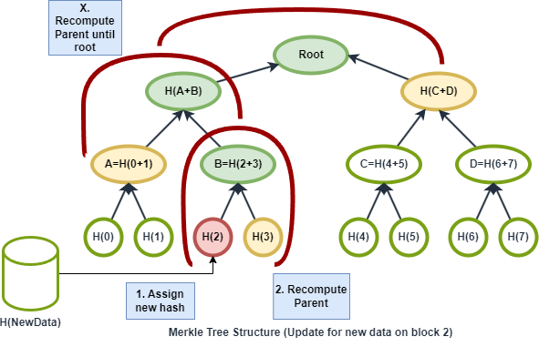

# EncryptFS: Encrypted Integrity-Preserving Filesystem

## Submission

- [Run instructions and README.md](./README.md)
- [Report](./Report.pdf)
- [Demo Documentation](./Demo.pdf)

## Authors
- Kaushal Patil (653639939)
- Vasu Garg (676073104)

## Key Features
- FUSE-based Implementation: Operates in user-space, allowing for enhanced security without kernel modifications.
- AES GCM Encryption: Provides strong encryption and authentication for data.
- Dynamically Expanding Volumes: Facilitates on-the-fly storage expansion to accommodate growing data needs.
- Cloud Backup and Restoration: Supports secure cloud storage solutions for disaster recovery.
- Merkle Tree Integrity Verification: Ensures data remains unaltered and secure against unauthorized changes.


## System Requirements
- Linux OS with FUSE support
- Development tools like GCC
- Libraries: FUSE, OpenSSL, libsodium, libcurl

## Installation

### Install Required Libraries for EncryptFS
```bash
sudo apt-get install libfuse-dev libssl-dev libsodium-dev libcurl4-openssl-dev # all the required libraries
```

### Install Required Libraries for Cloud Storage (Optional)
```bash
pip insall -r requirements.txt # all the required libraries for cloud storage microservice
```

### Build Instructions for EncryptFS

```bash
make # build the encryptFS
```

### Key Generation

```bash
./encryptFS.out keygen ./key.txt # generate a new key 'path is customizable'
```

### Mounting EncryptFS (Local)

Example:

```bash
./encryptFS.out -f -d ~/hello ./superblock.bin ./key.txt # mount the encryptFS to ~/hello using superblock.bin and key.txt (used for aes encryption and decryption)
```

### Mounting EncryptFS (Cloud)

> Requires the Cloud Storage service to be running and authenticated (Have the tokens stored in the tokens.txt file)

Example:

```bash
./encryptFS.out -f -d ~/hello remote:encryptfs/superblock.bin ./key.txt  # mount the encryptFS to ~/hello using superblock.bin on google cloud and key.txt (used for aes encryption and decryption)
```

> Your google drive should contain a folder named `encryptfs` and the superblock.bin file should be present in that folder, if its not present then the program will create a new superblock.bin file in the folder.

### Unmounting EncryptFS

```bash
fusermount -u ~/hello # unmount  encryptFS
```

### Clean Up

```bash
make clean # clean the build and volume files
```

> clean the build files and volumes created by encryptFS, store the superblock.bin and associated files in the cloud storage or somewhere else before calling this command

### Running Cloud Storage Service

#### Setup for Google Drive API

1. Go to the [Google Cloud Console](https://console.cloud.google.com/).
2. Create a new project.
3. Enable the Google Drive API.
4. Create OAuth 2.0 credentials.
5. Download the credentials as a JSON file and save it as `credentials.json` in the same directory as the `cloud_storage.py` file.

#### Running the Service

```bash
python cloud_storage.py
```

> for creating the tokens.txt to authenticate the cloud storage service, visit [service url](http://127.0.0.1:8080) and authenticate the service, make sure the tokens.txt is present.

## Testing Instructions
 
```bash
cd ~/hello # Mount point
touch cat.txt # Create a file
echo "hello my name is cat. And I am very cute hehehe hello " > cat.txt # Write to the file, updated merkle tree
cat cat.txt # Read the file, integrity check will be performed
ls -l # List the files, in the root directory
nano dog.txt # Create a new file you can paste content more then block size to check multi block allocation and read
cat dog.txt # Read the file, integrity check will be performed
# other supported operations can be tested as well like cp, mv, rm -rf, etc.
# test image files 
cp ./assets/cat.jpg ~/hello/
cp ./assets/cat.mp3 ~/hello/
feh ~/hello/cat.jpg # view the image
vlc ~/hello/cat.mp3 # play the audio
```

## File System Structure


### Internal Structure


## Merkle Tree Structure


### Merkle Tree Verification


### Merkle Tree Update



## Algorithms

### Create, Read, Write


### Mount, Unmount


### Misc

